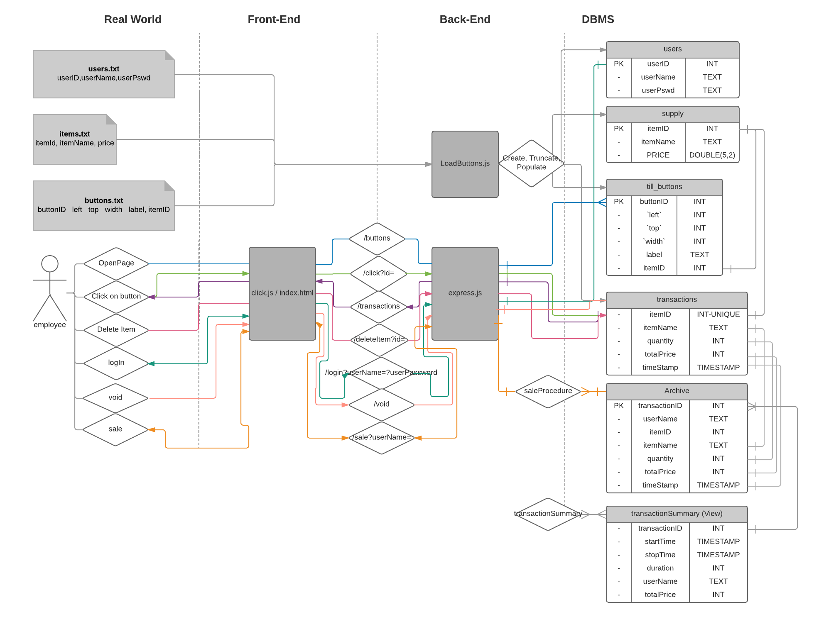
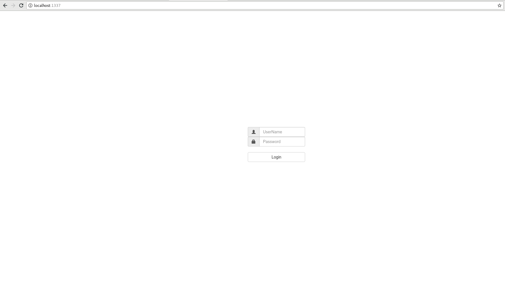
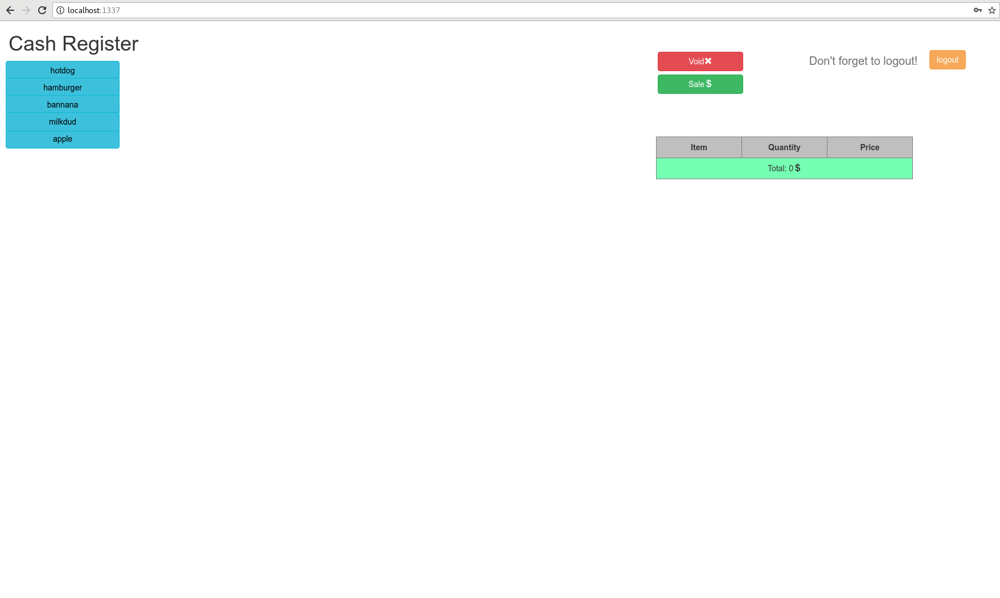
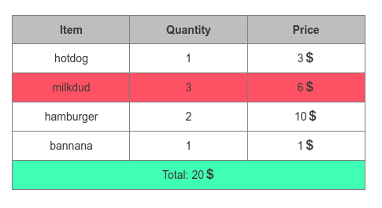
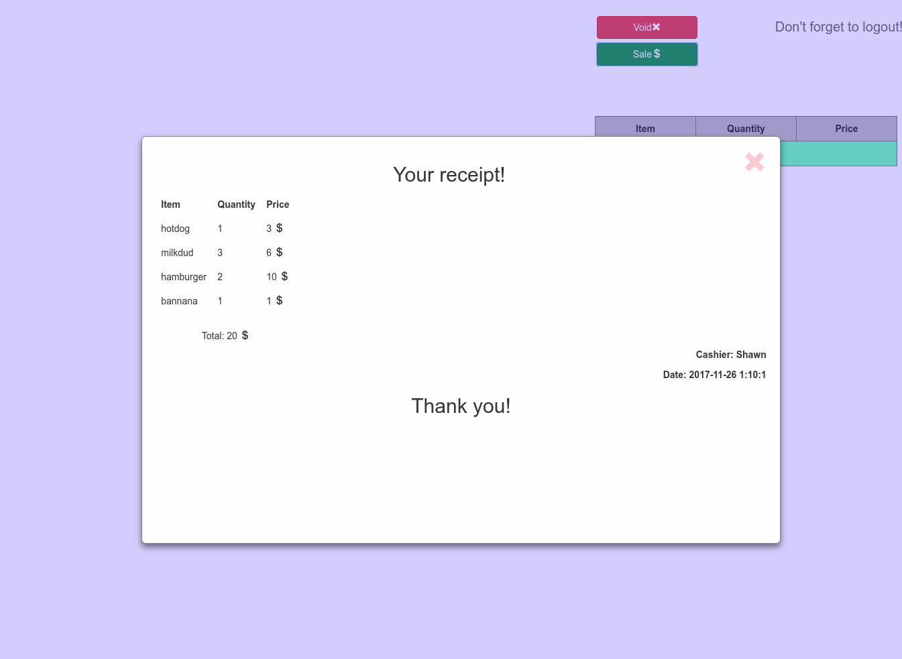

# User Manual

### Content
* [How to run the server](#run_server)
  * [Setup](#setup)
  * [Running the Server](#running)
  * [Restarting the Server](#restarting)
  * [Database Structure](#db_struct)
  * [ERD Diagram](#ERD)
* [How to use the website](#how_to_use)
* [Appendix: API](#api)

## How to run the server: <a id="run_server"></a>
### Setup <a id="set"></a>
To run the server you need to install some libraries first.
Once you are in the main project directory, run this:

```bash
npm install mysql
npm install bluebird
npm install express
```
Our project uses a stored procedure for some features; this stored procedure will need to be added to the database. To do this, move to the project's top directory, connect to maria db, and run *SOURCE saleProcedure.sql*.
The command should look like this:
``` SQL
MatriaDB [<your_database_name>] SOURCE saleProcedure.sql
```

### Running the Server <a id="running"></a>
To run the server, move to the project's top directory and run the following in the shell:
```bash
./runServer.sh <your_database_name>

```
 This script assumes that the location of your credentials (to log onto the database), is named **credentials.json**, and should be located in the project directory. credentials.json should look like the following:

 ``` json
{
  "user": "your username",
  "password": "your password"
}
 ```

 The script will also assume that project directory will have a directory called `resources` and that it should have these text files: `items.txt`, `users.txt`  and `buttons.txt`.

### Restarting the Server <a id="restarting">
You can also restart the server without risk of loosing data the database by running *restartServer.sh*. The command should look like this:
```bash
./restartServer.sh <your_database_name>
```

### Database structure <a id="db_struct"></a>

#### How text files interact with the database.  
Our database structure consists of five tables: users, supply, till_buttons,
transactions, and archive.
`./runServer.sh` calls a file named `loadData.js` to create, truncate, and populate these tables. `loadData.js` uses three text files, written by the user to populate certain tables. To enter information in these textfiles correctly, look at the following files in `/resources`. The values for each table are listed below, and all fields are tab spaced.
### `items.txt`  

  The `items.txt` textfile is used to populate the `supply` table. supply contains the master information about items, their name, and price. It has the following structure:
``` SQL
+----------+-------------+------+-----+---------+-------+
| Field    | Type        | Null | Key | Default | Extra |
+----------+-------------+------+-----+---------+-------+
| itemID   | int(11)     | NO   | PRI | NULL    |       |
| itemName | text        | YES  |     | NULL    |       |
| price    | double(5,2) | YES  |     | NULL    |       |
+----------+-------------+------+-----+---------+-------+
```
### `buttons.txt`
`till_buttons` is populated from the `buttons.txt` file, and has a field itemID, that directly corresponds to the `supply` table. The left, top, and width fields correspond to a location on the client. It has the following structure:  
``` SQL
+----------+---------+------+-----+---------+-------+
| Field    | Type    | Null | Key | Default | Extra |
+----------+---------+------+-----+---------+-------+
| buttonID | int(11) | NO   | PRI | NULL    |       |
| left     | int(11) | YES  |     | NULL    |       |
| top      | int(11) | YES  |     | NULL    |       |
| width    | int(11) | YES  |     | NULL    |       |
| label    | text    | YES  |     | NULL    |       |
| itemID   | int(11) | YES  |     | NULL    |       |
+----------+---------+------+-----+---------+-------+
```

### `users.txt`
   `users.txt` is used for `users`, the table that contains the usernames for all employees and their passwords. This table has the following structure:
``` SQL
+----------+---------+------+-----+---------+-------+
| Field    | Type    | Null | Key | Default | Extra |
+----------+---------+------+-----+---------+-------+
| userID   | int(11) | NO   | PRI | NULL    |       |
| userName | text    | YES  |     | NULL    |       |
| userPswd | text    | YES  |     | NULL    |       |
+----------+---------+------+-----+---------+-------+
```
### Other database tables that involved in the project
### `transactions` table
The `transactions` table is created from `loadData.js`, but it does not have any records until an employee enters them on the user interface. The transactions table keeps track of what items are on the price list, and the employee can add, and delete things indirectly into this table. It shares a field, **itemID**, with `supply`. This field corresponds to a primary key in `supply`. The `transactions` table has the following form:  

``` SQL
+------------+-----------+------+-----+-------------------+-----------------------------+
| Field      | Type      | Null | Key | Default           | Extra                       |
+------------+-----------+------+-----+-------------------+-----------------------------+
| itemID     | int(11)   | YES  | UNI | NULL              |                             |
| itemName   | text      | YES  |     | NULL              |                             |
| quantity   | int(11)   | YES  |     | NULL              |                             |
| totalPrice | int(11)   | YES  |     | NULL              |                             |
| timeStamp  | timestamp | NO   |     | CURRENT_TIMESTAMP | on update CURRENT_TIMESTAMP |
+------------+-----------+------+-----+-------------------+-----------------------------+
```

### `archive` table
The `archive` table is created from loadData.js, but it does not have any record until the `sale` button is clicked. Once `sale` button is clicked the `saleProcedure` is called. This procedure copies everything from `transactions` table and stores it in the `archive` table. The `archive` table has two more fields: *transactionID*, and *userName*. The transactionID is unique for every set of records added when the sale button is clicked. The archive table has the following structure:
``` SQL
+---------------+-----------+------+-----+-------------------+-----------------------------+
| Field         | Type      | Null | Key | Default           | Extra                       |
+---------------+-----------+------+-----+-------------------+-----------------------------+
| transactionID | int(11)   | YES  |     | NULL              |                             |
| userName      | text      | YES  |     | NULL              |                             |
| itemID        | int(11)   | YES  |     | NULL              |                             |
| itemName      | text      | YES  |     | NULL              |                             |
| quantity      | text      | YES  |     | NULL              |                             |
| totalPrice    | int(11)   | YES  |     | NULL              |                             |
| timeStamp     | timestamp | NO   |     | CURRENT_TIMESTAMP | on update CURRENT_TIMESTAMP |
+---------------+-----------+------+-----+-------------------+-----------------------------+
```

### `transactionSummary` view
The `transactionSummary` view is created from loadData.js. This view summarizes the `archive` table. This view has the following structure:

``` SQL
+---------------+---------------+------+-----+---------+-------+
| Field         | Type          | Null | Key | Default | Extra |
+---------------+---------------+------+-----+---------+-------+
| transactionID | int(11)       | YES  |     | NULL    |       |
| startTime     | timestamp     | YES  |     | NULL    |       |
| stopTime      | timestamp     | YES  |     | NULL    |       |
| duration      | bigint(21)    | YES  |     | NULL    |       |
| userName      | text          | YES  |     | NULL    |       |
| totalPrice    | decimal(32,0) | YES  |     | NULL    |       |
+---------------+---------------+------+-----+---------+-------+
```
### ERD Diagram <a id="ERD"></a>
The following is a diagram that indicates all tables, and interactions in our project:



## How to use the website <a id="how_to_use"></a>
To get to the website go to this link: http://localhost:1337
Once you get there you will need to log in

Type *user* for `userName` and *password* for `Password` to login. (You can also make your own user and password in *users.txt*)



Once you login, you will see the user interface.



In order to proceed the transaction, press the buttons on the left to choose the items that you want to buy.

If you want to remove an item from till, simply click on it.



You can also click `void` button if you want to remove everything from the till.

Once you ready to purchase click `sale` button and you can receive your receipt.



## Appendix: API <a id="api"></a>

* **GetButtons:** `/buttons`. Gets buttons from the `till_buttons` table. This is called whenever the page is reloaded.
* **ClickButton:** `/click?id=`. When a button is clicked, it passes an `itemID`. This id is sent via the API to `express.js` which in turn, uses the API to update the `transactions` table. If the `transactions` table does not have a record with the passed in `itemID`, it will fetch the itemName, and individual price from the `supply` table. If the table does have a record with `itemID` in it, it will update the quantity and totalPrice for that item.  
* **GetTransaction:** `/transactions`. This is called after the client side gets confirmation that the database has been successfully updated. It tells the server side to send all records from the `transactions` table.  
* **DeleteItem:** `/deleteItem?id=`. This is called when the employee clicks on the price list table on the front end. This triggers the front end to use the deleteItem API request using the item-id of the item in the priceList table. This value gets passed to the server side, where the item is deleted from the `transactions` table.
* **Login:** `/login?userName=<yourUserName>&password=<yourPassword>`. This is called when user is trying to login. The front end sends the username and user's password to the server and server checks if such username is stored in the `users` table in database. If such username and password exists server sends `true` back to the front end so the user can successfully login
* **Void:** `/void`. This is called when user clicks the `void` button. Front end sends this API request to the server side, then server truncates the `transactions` table in the database.
* **Sale:** `/sale?userName`. This is called when `sale` button is clicked. Once server receives this API request from the front end it calls the `saleProcedure` which copies data from the `transactions` table and stores it in the `archive` table. This API request also contains the current username so we can keep track of who proceeded the transaction.  
