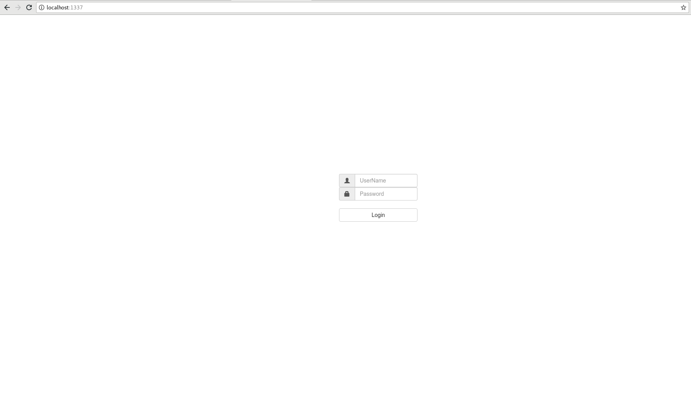
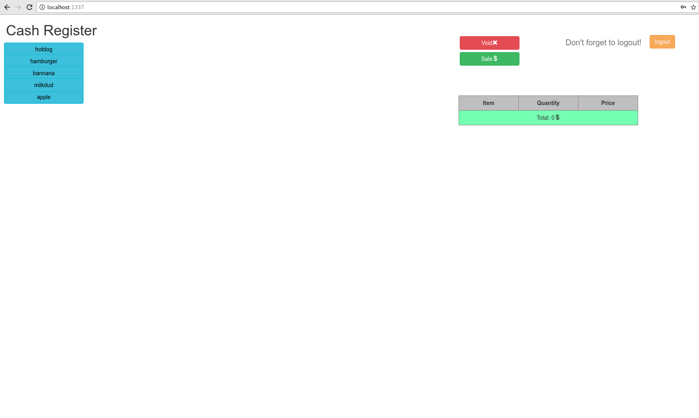
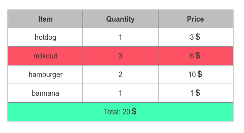
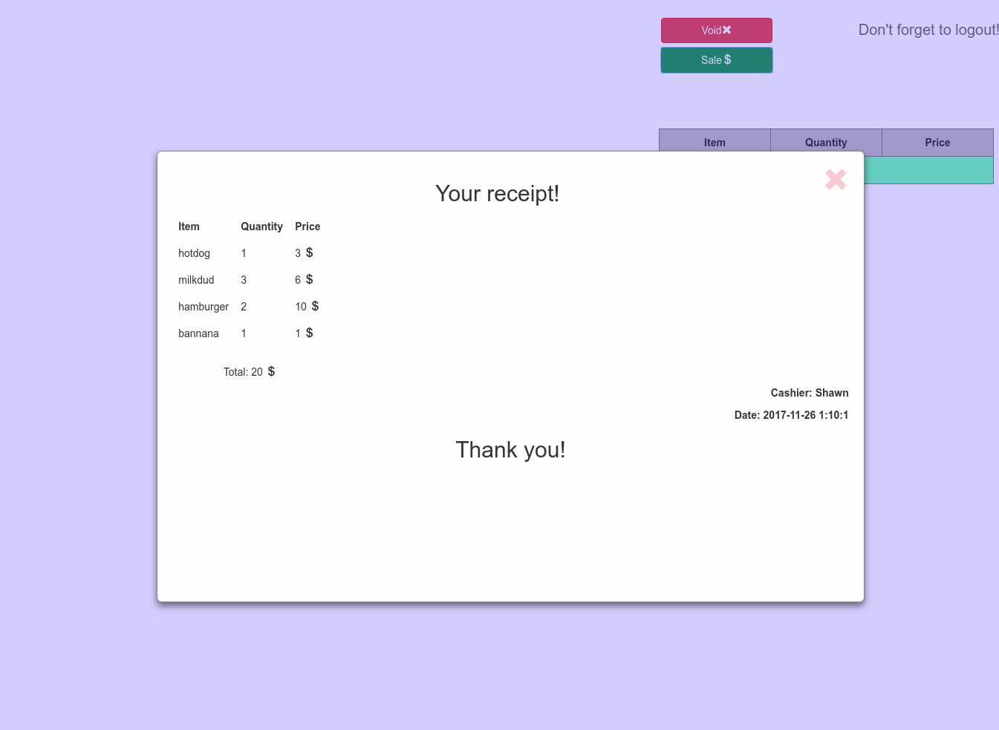

# User Manual

### Content
* [How to run the server](#run_server)
* [How to use the website](#how_to_use)
* [Appendix: API](#api)

## How to run the server: <a id="run_server"></a>
To run the server go to the project top directory and run in the shell:
```
./runServer.sh <your_database_name>

```
 This script assumes that the location of your credentials (to log onto the database), is named `credentials.json` and is located in `lab-9-shawnlennyformulaone`.

 The script will also assume that there will be a directory `lab-9-shawnlennyformulaone` that should have two text files: `items.txt`, `users.txt`  and `buttons.txt`.

  The `buttons.txt` is used for `till_buttons` table which has the following structure:

```
+----------+---------+------+-----+---------+-------+
| Field    | Type    | Null | Key | Default | Extra |
+----------+---------+------+-----+---------+-------+
| buttonID | int(11) | NO   | PRI | NULL    |       |
| left     | int(11) | YES  |     | NULL    |       |
| top      | int(11) | YES  |     | NULL    |       |
| width    | int(11) | YES  |     | NULL    |       |
| label    | text    | YES  |     | NULL    |       |
| itemID   | int(11) | YES  |     | NULL    |       |
+----------+---------+------+-----+---------+-------+
```
  The `items.txt` is used for `supply` table which has the following structure:
```
+----------+---------+------+-----+---------+-------+
| Field    | Type    | Null | Key | Default | Extra |
+----------+---------+------+-----+---------+-------+
| buttonID | int(11) | NO   | PRI | NULL    |       |
| left     | int(11) | YES  |     | NULL    |       |
| top      | int(11) | YES  |     | NULL    |       |
| width    | int(11) | YES  |     | NULL    |       |
| label    | text    | YES  |     | NULL    |       |
| itemID   | int(11) | YES  |     | NULL    |       |
+----------+---------+------+-----+---------+-------+

```
  The `users.txt` is used for `users` the table that contains the usernames and their passwords. This table has the following structure:
```
+----------+---------+------+-----+---------+-------+
| Field    | Type    | Null | Key | Default | Extra |
+----------+---------+------+-----+---------+-------+
| userID   | int(11) | NO   | PRI | NULL    |       |
| userName | text    | YES  |     | NULL    |       |
| userPswd | text    | YES  |     | NULL    |       |
+----------+---------+------+-----+---------+-------+

```

## How to use the website <a id="how_to_use"></a>
To get to the website go to this link: http://localhost:1337
Once you get there you will need to log in

Type "user" for `userName` and "password" for `Password` to login



Once you login you will see the user interface



In order to proceed the transaction press buttons on the left to choose the items that you want to buy.

If you want to remove the item from till simply click on it



You can also click `void` button if you want to remove everything from the till.

Once you ready to pzurchase click `sale` button and you can receive your receipt.



## Appendix: API <a id="api"></a>
There are four API end points that have been implemented in an effort to satisfy the requirements for the lab 8 REST API. The following are listed.
* **GetButtons:** `/buttons`. Gets buttons from the `till_buttons` table. This is called whenever the page is reloaded.
* **ClickButton:** `/click?id=`. When a button is clicked, it passes an `itemID`. This id is sent via the API to `express.js` which in turn, uses the API to update the `transactions` table. If the `transactions` table does not have a record with the passed in `itemID`, it will fetch the itemName, and individual price from the `supply` table. If the table does have a record with `itemID` in it, it will update the quantity and totalPrice for that item.  
* **GetTransaction:** `/transactions`. This is called after the client side gets confirmation that the database has been successfully updated. It tells the server side to send all records int the `transactions` table.  
* **DeleteItem:** `/deleteItem?id=`. This is called when the employee clicks on the price list table on the front end. This triggers the front end to use the deleteItem API request using the item-id of the item in the priceList table. This value gets passed to the server side, where the item is deleted from the `transactions` table.
